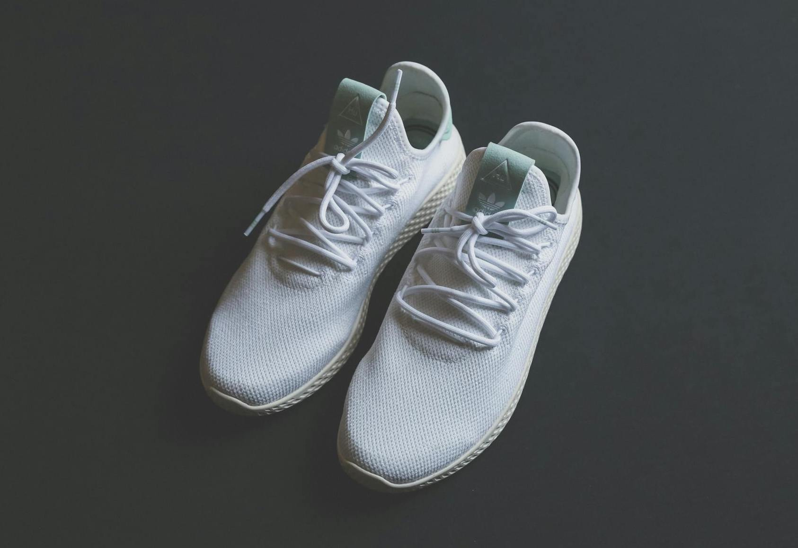

# 🏀 Basketball Social Club Website

A static website built using **HTML** and **CSS** for a Basketball Social Club. This project serves as a front-end design for a club that promotes basketball activities, events, and merchandise.

---

## 📋 Table of Contents
- [🏀 Basketball Social Club Website](#-basketball-social-club-website)
  - [📋 Table of Contents](#-table-of-contents)
  - [📝 About](#-about)
  - [✨ Features](#-features)
  - [🚀 How to View the Website](#-how-to-view-the-website)
  - [📂 Project Structure](#-project-structure)
  - [🛠️ Technologies Used](#️-technologies-used)
  - [📸 Screenshots](#-screenshots)
  - [📄 License](#-license)
  - [🙌 Acknowledgements](#-acknowledgements)

---

## 📝 About
This is a simple, responsive website designed for a **Basketball Social Club**. The website does not include any JavaScript functionality; it is purely built using HTML and CSS. The goal of this project is to provide a visually appealing online presence for a basketball club to showcase their activities, membership options, and an online store for merchandise.

---

## ✨ Features
- **Static HTML pages** with a clean and modern design.
- **Responsive design**: The website is optimized for both desktop and mobile devices.
- Includes multiple sections:
  - **Home page**: Introduction to the club.
  - **Presentation page**: Detailed information about the club.
  - **Contact form**: Simple form to get in touch.
  - **Store page**: Display of club merchandise.

---

## 🚀 How to View the Website
To view the website locally on your computer:

1. **Clone this repository**:
   ```bash
   git clone https://github.com/JoAnCaRo/proyecto_web.git
   cd proyecto_web
   ```

2. **Open the main HTML file**:
   - Double-click on `index.html` to open it in your web browser.
   - Alternatively, you can use the terminal:
     ```bash
     open index.html
     ```

---

## 📂 Project Structure
```
proyecto_web/
│
├── index.html            # Home page
├── presentacion.html     # Presentation page
├── formulario.html       # Contact form page
├── tienda.html           # Store page
│
├── css/
│   └── style.css         # Main stylesheet
│
├── images/               # Image assets
│   ├── presentation_pic.jpg
│   ├── inicio_pic.jpg
│   ├── sneakers.jpg
│   └── basket_ball.jpg
│
├── icons/                # Icons used in the website
├── logo/                 # Club logos
└── .vscode/              # VSCode settings (optional)
```

---

## 🛠️ Technologies Used
- **HTML5**
- **CSS3**

---

## 📸 Screenshots
Here are a few previews of the website:

- **Home Page**:
  

- **Presentation Page**:
  

- **Store Page**:
  

---


## 📄 License
This project is open-source and available under the MIT License.

---

## 🙌 Acknowledgements
Special thanks to everyone who supported the creation of this project!

Happy browsing! 🏀😊
